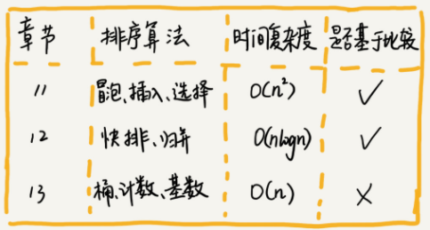

# 排序算法
>排序算法的就是进行对数据排序的指令集合,
>排序算法的基本概述 

## 分析排序算法
- 排序效率(复杂度)

- 排序算法的稳定性
> 在原序列中A1在A2之前,在排序算法之后,A1还是在A2之前,可以说这个排序算法是稳定的

需求: 排序订单对象,按照金额排序,如果金额相同按照时间排序

> 稳定排序,我们先按照时间排序,然后在按照金额排序,这样可以看到235的前后顺序是不变的,这也就是稳定排序

## 冒泡排序

> 
## 插入排序

> 现实中的就是扑克牌,构建有序序列,对于未排序的序列,在已排序的序列从后向前扫描,找到对应的位置,插入数据
## 归并排序
这个算法,还无法实现